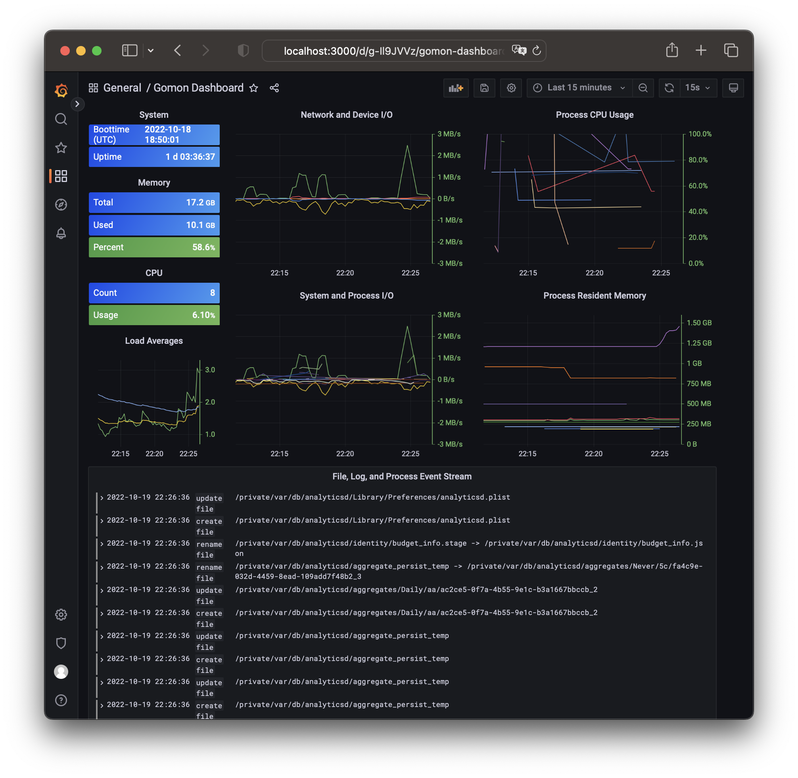

# **Welcome to the *Gomon* Backend Data Source Plugin for *Grafana***


- [Overview](#overview)
- [Installing the *Gomon Data Source*](#installing-the-gomon-data-source)
  - [Pre-requisites](#pre-requisites)
  - [Download the Gomon Data Source](#download-the-gomon-data-source)
  - [Build the Data Source Frontend](#build-the-data-source-frontend)
  - [Build the Data Source Backend](#build-the-data-source-backend)
  - [Authorize the Data Source Backend](#authorize-the-data-source-backend)
  - [Install the Gomon Data Source](#install-the-gomon-data-source)
  - [Restart the Grafana Server](#restart-the-grafana-server)
- [Explore](#explore)
- [Notices](#notices)

## Overview

The *[Gomon Data Source](https://github.com/zosmac/gomon-datasource)* queries a system’s processes and displays a node graph of their inter-process connections. The backend component periodically performs data collection to identify the inter-process connections. The frontend component formats and presents the processes and connections in a node graph.

For more information about backend plugins, refer to the documentation on [Grafana Backend Plugins](https://grafana.com/docs/grafana/latest/developers/plugins/backend/).

For more information about node graph visualization, refer to the documentation on the [Grafana Node Graph Panel](https://grafana.com/docs/grafana/latest/panels/visualizations/node-graph/).

## Installing the *Gomon Data Source*

### **Pre-requisites**

Building the frontend component depends on the [Node](https://nodejs.org) runtime and the [Yarn classic](https://classic.yarnpkg.com) package manager. Download the Node installer for your system and install. Then use Node’s Package Manager (npm) to install Yarn:

```zsh
sudo npm install -global yarn
```

Building the backend component depends on [Go](https://golang.org). Download [Go's installer](https://golang.org/dl) for your system and install.

The plugin’s build and deployment use the [Mage](https://magefile.org) build tool. Follow the instructions on the site to install Mage.

### **Download the [Gomon Data Source](https://github.com/zosmac/gomon-datasource)**

*Note: the directory location for the data source is* `grafanas`, *adjacent to the grafana directory.*

```zsh
mkdir $GRAFANA_DIR/../grafanas
cd $GRAFANA_DIR/../grafanas
git clone https://github.com/zosmac/gomon-datasource
cd gomon-datasource
go mod init github.com/zosmac/gomon-datasource
mage -v upgrade
```

### **Build the Data Source Frontend**

```zsh
mage -v frontend
```

### **Build the Data Source Backend**

*Note:* `backend` *is the default build.*

```zsh
mage -v [backend]
```

### **Authorize the Data Source Backend**

The backend’s query of process connections requires root authority. Therefore, the backend module must be owned by root with its setuid permission set:

```zsh
sudo chown 0:0 dist/gomon-datasource_$(go env GOOS)_$(go env GOARCH)
sudo chmod u+s dist/gomon-datasource_$(go env GOOS)_$(go env GOARCH)
```

### **Install the Gomon Data Source**

The Magefile includes an install target that

- copies a custom.ini configuration file to the `$GRAFANA_DIR/conf` that sets `plugins:allow_loading_unsigned_plugins = zosmac-gomon-datasource`
- installs the gomon-datasource data source
- installs the gomon-process-node-graph dashboard

```zsh
mage -v install
```

### **Restart the Grafana Server**

```zsh
sudo kill $(pgrep grafana-server)
$GRAFANA_DIR/bin/$(go env GOOS)-$(go env GOARCH)/grafana-server
```

## Explore



## Notices

Copyright © 2021-2023 The Gomon Project.
