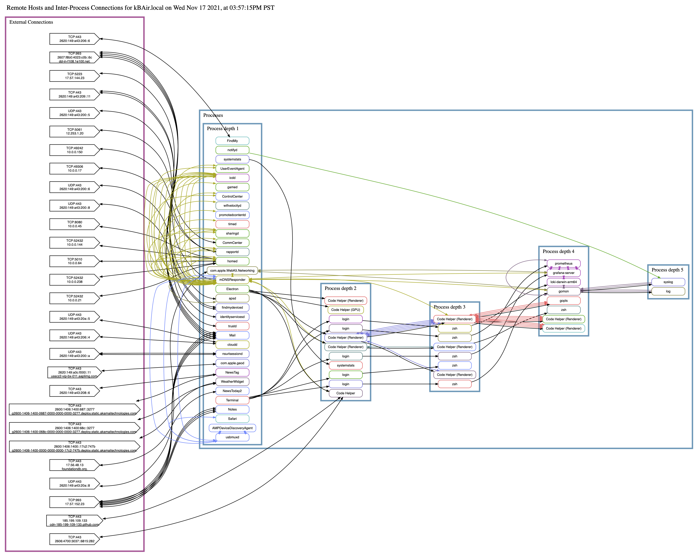

# Welcome to the Gomon Backend Data Source Plugin for Grafana


- [Overview](#overview)
- [Installing the Gomon Data Source](#installing-the-gomon-data-source)
  - [Pre-requisites](#pre-requisites)
  - [Download the Gomon Data Source](#download-the-gomon-data-source)
  - [Build the Data Source Frontend](#build-the-data-source-frontend)
  - [Build the Data Source Backend](#build-the-data-source-backend)
  - [Install the Data Source](#install-the-data-source)
- [Employing Prometheus, Loki, and Grafana](#employing-prometheus-loki-and-grafana)
  - [Prometheus](#prometheus)
  - [Loki](#loki)
  - [Grafana](#grafana)
- [Putting it all together](#putting-it-all-together)
  - [Start the servers](#start-the-servers)
    - [Prometheus](#prometheus-1)
    - [Loki](#loki-1)
    - [Grafana](#grafana-1)
  - [Add Prometheus and Loki Data Sources to Grafana](#add-prometheus-and-loki-data-sources-to-grafana)
    - [Configure the Prometheus Data Source](#configure-the-prometheus-data-source)
    - [Configure the Loki Data Source](#configure-the-loki-data-source)
  - [Install the Gomon Data Source Dashboard to Grafana](#install-the-gomon-data-source-dashboard-to-grafana)
- [Visualize](#visualize)
  - [Gomon Data Source Dashboard](#gomon-data-source-dashboard)
  - [Grafana Inter-process and remote host connections node graph](#grafana-inter-process-and-remote-host-connections-node-graph)
  - [Graphviz Inter-process and remote host connections node graph](#graphviz-inter-process-and-remote-host-connections-node-graph)
- [Notices](#notices)

## Overview

The [Gomon Data Source](https://github.com/zosmac/gomon-datasource) measures the state of the system, including its CPU, memory, filesystems, network interfaces, and processes. The Data Source also observes system logs and the system's management of files and processes. Hence, data source processing consists of two fundamental operations: measurement and observation.

The measurements of the system are performed through kernel interfaces that report the state of resources of the system: the CPU, the memory, the filesystems, the network interfaces, and the processes.

The observations of the system are events captured by the logging, file management, and process management subsystems. While not observing these events directly, the Data Source assumes that subsystem reporting is timely. A potential enhancement would be for the data source to initiate its own log, file, and process events to measure periodically the lag between initiation and reporting of these events.

The Gomon Data Source streams the measurements to [Prometheus](http://prometheus.io) and the observations to [Loki](https://grafana.com/oss/loki/) to record. In turn, [Grafana](https://grafana.com) references Prometheus and Loki to chart the measurements and report the observations. The data source `assets` folder includes a [Grafana Dashboard](assets/dashboard.json) to graph the streams to illustrate system conditions.

The data source can also format and present the system's inter-process connections in a [Grafana Node Graph Panel](https://grafana.com/docs/grafana/latest/panels/visualizations/node-graph/). Alternatively, if [Graphviz](<https://graphviz.org>) is installed, the data source can render the inter-process connections node graph in a web view.

For more information about backend plugins, refer to the documentation on [Grafana Backend Plugins](https://grafana.com/docs/grafana/latest/developers/plugins/backend/).

## Installing the Gomon Data Source

### Pre-requisites

Building the frontend component depends on the [Node](https://nodejs.org) runtime. Download the Node installer for your system and install.

Building the backend component depends on [Go](https://golang.org). Download [Go's installer](https://golang.org/dl) for your system and install.

The plugin’s build and deployment use the [Mage](https://magefile.org) build tool. Follow the instructions on the site to install Mage.

### Download the [Gomon Data Source](https://github.com/zosmac/gomon-datasource)

```sh
git clone https://github.com/zosmac/gomon-datasource
cd gomon-datasource
```

### Build the Data Source Frontend

```sh
mage -v frontend
```

### Build the Data Source Backend

Note: `backend` is the default build.

```sh
mage -v [backend]
```

### Install the Data Source

The data source backend plugin is built into the `dist` subdirectory. Copy the contents to the Grafana plugins directory. The backend’s query of process connections requires root authority. Therefore, the backend module must be owned by root with its setuid permission set.

```sh
cp -R dist/ ${PLUGINS_DIR}/zosmac-gomon-datasource

cd ${PLUGINS_DIR}/zosmac-gomon-datasource
sudo chown 0:0 gomon-datasource_$(go env GOOS)_$(go env GOARCH)
sudo chmod u+s gomon-datasource_$(go env GOOS)_$(go env GOARCH)
```

## Employing Prometheus, Loki, and Grafana

Follow these steps for deploying the three servers that record measurements ([Prometheus](http://prometheus.io)) and observations ([Loki](https://grafana.com/oss/loki/)) to facilitate visualization ([Grafana](https://grafana.com)).

### Prometheus

[Prometheus](http://prometheus.io) is an open-source systems monitoring server for scraping and storing time-series data. At startup, the data source opens a `/metrics` endpoint for Prometheus to collect the measurements stream.

To install Prometheus, select an appropriate binary from the [Prometheus download page](https://prometheus.io/download/) for your Operating System and Architecture, download, and install.

To enable collection, open the `prometheus.yml` configuration file for the Prometheus deployment and add the following to `scrape_configs` (a sample configuration file is in [`assets/prometheus.yml`](assets/prometheus.yml)):

```yml
  - job_name: "gomon-datasource"
    scheme: https
    tls_config:
      ca_file: /etc/ssh/cert.pem
    static_configs:
      - targets: ["localhost:1234"]
```

### Loki

[Loki](https://grafana.com/oss/loki/) is an open-source log aggregation server. Via the data source's HTTP POSTs to the `/loki/api/v1/push` endpoint, Loki receives the data source observations. To install Loki, create a `loki` folder, select appropriate `loki` and `promtail` binaries from the list of Assets on the [Loki releases page](https://github.com/grafana/loki/releases/latest) for your platform, and download. Each binary also requires a configuration file; follow the instructions on the [Loki installation page](https://grafana.com/docs/loki/latest/installation/local) to copy these to the `loki` folder.

```sh
cd ${LOKI_DIR}
unzip =(curl -L "https://github.com/grafana/loki/releases/latest/download/loki-$(go env GOOS)-$(go env GOARCH).zip")
unzip =(curl -L "https://github.com/grafana/loki/releases/latest/download/promtail-$(go env GOOS)-$(go env GOARCH).zip")
chmod a+x loki-$(go env GOOS)-$(go env GOARCH) promtail-$(go env GOOS)-$(go env GOARCH)
curl -O -L "https://raw.githubusercontent.com/grafana/loki/main/cmd/loki/loki-local-config.yaml"
curl -O -L "https://raw.githubusercontent.com/grafana/loki/main/clients/cmd/promtail/promtail-local-config.yaml"
```

### Grafana

To install Grafana, select an appropriate binary from the [Grafana download page](https://grafana.com/grafana/download) for your platform, download, and install.

## Putting it all together

### Start the servers

#### Prometheus

```sh
cd ${PROMETHEUS_DIR}
./prometheus >>prometheus.log 2>&1 &
```

#### Loki

```sh
cd ${LOKI_DIR}
./loki-$(go env GOOS)-$(go env GOARCH) -config.file loki-local-config.yaml >>loki.log 2>&1 &
```

#### Grafana

```sh
cd ${GRAFANA_DIR}
GF_PATHS_PLUGINS=${PLUGINS_DIR} GF_PLUGINS_ALLOW_LOADING_UNSIGNED_PLUGINS=zosmac-gomon-datasource bin/grafana-server web >>grafana.log 2>&1 &
```

### Add Prometheus and Loki [Data Sources](http://localhost:3000/datasources/new) to Grafana


### Configure the Prometheus Data Source

Note: while the Data Source's Settings Panel shows the default data source URL, you must still type it into the URL field. Then, scroll down and select Save & test.


### Configure the Loki Data Source

Note: while the Data Source's Settings Panel shows the default data source URL, you must still type it into the URL field. Then, scroll down and select Save & test.


### Install the [Gomon Data Source Dashboard](assets/dashboard.json) to Grafana

```sh
curl ${GRAFANA_CRED} -X POST -i -w "\n" -H "Content-Type: application/json" -T ./assets/dashboard.json "http://localhost:3000/api/dashboards/db"
```

## Visualize

### Gomon Data Source Dashboard

[](<http://localhost:3000>)

### Grafana Inter-process and Remote Host Connections Node Graph


### Graphviz Inter-process and Remote Host Connections Node Graph

If [Graphviz](<https://graphviz.org>) is installed, Gomon can render a node graph of the inter-process and remote host connections via the `/gomon` endpoint:

[](<http://localhost:1234/gomon>)

To download and install [Graphviz](<https://graphviz.org/download/source/>), select a stable release, download its tar file, build, and install.

Note: `gomon-datasource` specifies `-Tsvgz` to the `dot` command. Ensure that the zlib development library is installed on your system, e.g. on Ubuntu `sudo apt install zlib1g-dev`, on Fedora `sudo yum install zlib devel`.

```sh
tar xzvf =(curl -L "https://gitlab.com/api/v4/projects/4207231/packages/generic/graphviz-releases/7.1.0/graphviz-7.1.0.tar.gz")
cd graphviz-7.1.0
./configure
make
sudo make install
```

Note: installing from the git repository (i.e. `git clone https://gitlab.com/graphviz/graphviz/`) requires pre-configuration with `autogen.sh`, which in turn requires GNU autoconf, automake, and libtool. Find details at <https://graphviz.org/download/source/#git-repos>

## Notices

Copyright © 2021-2023 The Gomon Project.
